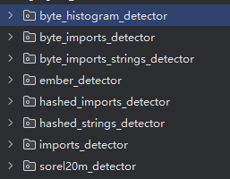

# 训练GAN需要的文件类型
## csv文件
`/data/BODMAS_benign.csv`
## 划分数据集
`split_annotations_into_training_validation_test.py`
分别得到benign和maliciou注释的划分：

`BODMAS_benign_train_None.csv`

`BODMAS_benign_test_None.csv`

`BODMAS_benign_validation_None.csv`

## npz文件
### ember_feature
+ ember_features/2017:
+ ember_features/2018:
+ raw_npz/和raw/
### histogram_features
+ histogram_features
### import_features(API features)
+ hashed_import_features
+ imports:这个是放json文件的库
+ imports_features
### string_features
+ hashed_string_features
+ string_features
+ allstrings
  
**注意：默认不创建allstrings和hashed_string_features**


# 1) 数据集的准备
**良性和恶意的都要创建**，也就是操作执行两次

## １.１byte_histogram
这里正常填参数就行
## １.１import_feature
先获得自己的vocabulary_mapping，**不然训练时特征向量维度会变！**

``api_functions/count_functions.py``：获得数据集对应的json文件

``features_extractor/imports_vocabulary/baseline/create_vocabulary_mapping.py``：创建vocabulary_mapping
## １.１string_feature

这个也是先创建vocabulary_mapping

``strings/find_strings_from_executable.py``：创建自己数据集对应的json文件

``get_top_strings``：获得前top20000的json数据集(对应论文中TOP-K)，特征向量不一定有20000个维度

``create_vocabulary_mapping.py``，创建vocabulary_mapping

``create_all_features_dataset.py``之前，**请先修改这段代码**：``get_allstrings``实现在feature_extractor/utils.py中
```python
            #get_allstrings实现在feature_extractor/util中
            print("Extract AllStrings features")
            src.feature_extractor.utils.save_all_strings(
                strings_feature_extractor.get_allstrings(),
                os.path.join(args.allstrings_filepath, '{}.txt'.format(filename))
            )
```
恢复这段代码：
```python
        allstrings_array = np.array(strings_feature_extractor.get_allstrings(), dtype=np.str)
        savez_compressed(os.path.join(args.allstrings_filepath, '{}.txt'.format(filename)),allstrings_array)
```

``create_all_features_dataset.py``一键创建所有数据集

```split_annotations_into_training_validation_test.py```划分一下数据集
# 2)训练inception检测器
强制绑定，注释不了，建议随便训练训练

inception检测器有两种：byte和iat;iat好像对应import/string特征，**两个都要训练**
## 1.1提取`EMBER`
`src\ml_models\lightgbm_models\byte_histogram_detector\prepare_datasets.sh`：运行这个脚本(极慢，不推荐)

这里有很多个目录，每个目录都可以提取EMBER的不同特征，都可以用来训练Inception



作为测试，我只运行了`\byte_histogram_detector\create_byte_histogram_training_and_test_sets_2017.py`

生成的好像是一个csv文件，可能会有以下BUG：

**每一个csv的行间隔有一个空格，需要及时清除**
```PY
    # 上述文件处理过程加入以下代码
        if not line.strip():  # 跳过空行
            continue
```
这里是对`EMBER`数据集进行初步提取，获得是inception训练的数据集
## 1.2 byte_histogram的数据集
`create_byte_histogram_inception_dataset.py`
## 1.2 iat
`create_iat_inception_dataset.py`
## 1.3 intermediate_feature
获取不同特征的中间特征向量
`retrieve_byte_histogram_features_from_benign_executables.py`

`retrieve_import_features_from_benign_executables.py`
##  训练inception
```python
    """文件格式：.npz"""
    parser.add_argument("--training_filepath",
                        type=str,
                        help="Filepath to the training features",
                        default="./data/iat_features/2017/training/")# npz
    parser.add_argument("--testing_filepath",
                        type=str,
                        help="Filepath to the testing features",
                        default="./data/iat_features/2017/testing/")# npz
    parser.add_argument("--network_parameters",
                        type=str,
                        help="Network parameters",
                        default="network_parameters/iat_net_params.json"
                        )
    parser.add_argument("--training_parameters",
                        type=str,
                        help="Training parameters",
                        default="training_parameters/training_params_test.json"
                        )
    parser.add_argument("--output_filepath",
                        type=str,
                        help="Output filepath",
                        default="models/imports_model_2017")# output
```
```python
    parser.add_argument('--iat', dest='iat', action='store_true')
    parser.add_argument('--no-iat', dest='iat', action='store_false')
    parser.set_defaults(iat=True)

    parser.add_argument('--byte', dest='byte', action='store_true')
    parser.add_argument('--no-byte', dest='byte', action='store_false')
    parser.set_defaults(byte=False)
```
# 3)训练GANS
后面有注释# 
## 3.1byte_histogram
```python
    """良性软件"""
    parser.add_argument("--goodware_histogram_features_filepath",
                        type=str,
                        help="Filepath to benign import features",
                        default="../../../../npz/BODMAS/histogram_features/benign/")#npz
    parser.add_argument("--goodware_ember_features_filepath_version1",
                        type=str,
                        help="Filepath to goodware EMBER features (Version 1)",
                        default="../../../../npz/BODMAS/ember_features/2017/benign/")#npz
    parser.add_argument("--goodware_ember_features_filepath_version2",
                        type=str,
                        help="Filepath to goodware EMBER features (Version 2)",
                        default="../../../../npz/BODMAS/ember_features/2018/benign")#
    parser.add_argument("--goodware_raw_executables_filepath",
                        type=str,
                        help="Filepath to goodware raw executables",
                        default="../../../../raw/BODMAS/benign")#binary
    parser.add_argument("--goodware_raw_npz_executables_filepath",
                        type=str,
                        help="Filepath to goodware raw executables",
                        default="../../../../npz/BODMAS/raw_npz/benign/")#npz

    parser.add_argument("--training_goodware_annotations_filepath",
                        type=str,
                        help="Filepath to benign annotations (training)",
                        default="../../../../src/annotations/byte_histogram/data/BODMAS_benign_train_None.csv")#

    parser.add_argument("--validation_goodware_annotations_filepath",
                        type=str,
                        help="Filepath to benign annotations (validation)",
                        default="../../../../src/annotations/byte_histogram/data/BODMAS_benign_validation_None.csv")#

    """模型参数"""
    parser.add_argument("--output_filepath",
                        type=str,
                        help="Generator and discriminator torch models filepaths",
                        default="models/Conditional_GAN_byte_features/")# 这个是输出到空文件夹下

    parser.add_argument("--generator_parameters_filepath",
                        type=str,
                        help="Filepath of the generator parameters",
                        default="hyperparameters/generator_network/baseline_parameters.json")# z-size:64
    parser.add_argument("--discriminator_parameters_filepath",
                        type=str,
                        help="Filepath of the discriminator parameters",
                        default="hyperparameters/discriminator_network/baseline_parameters.json")
    parser.add_argument("--training_parameters_filepath",
                        type=str,
                        help="Training parameters filepath",
                        default="training_parameters/training_parameters_final.json")

    """测试集"""
    parser.add_argument("--test_malware_annotations_filepath",
                        type=str,
                        help="Filepath to malware annotations (test)",
                        default="../../../../src/annotations/byte_histogram/data/BODMAS_malicious_test_None.csv")
    parser.add_argument("--test_goodware_annotations_filepath",
                        type=str,
                        help="Filepath to benign annotations (test)",
                        default="../../../../src/annotations/byte_histogram/data/BODMAS_benign_test_None.csv")
    parser.add_argument("--feature_version",
                        type=int,
                        help="EMBER feature version",
                        default=2)
```
# 3.2 imports
    parser.add_argument("--vocabulary_mapping_filepath",
                        type=str,
                        help="Vocabulary mapping filepath",
                        default="../../../../src/feature_extractors/imports_vocabulary/baseline/vocabulary/vocabulary_mapping_test.json")#你自己数据的mapping
    parser.add_argument("--inverse_vocabulary_mapping_filepath",
                        type=str,
                        help="Inverse vocabulary mapping filepath",
                        default="../../../../src/feature_extractors/imports_vocabulary/baseline/vocabulary/inverse_vocabulary_mapping_test.json")# 你自己数据的mapping
    """输出路径"""
    parser.add_argument("--output_filepath",
                        type=str,
                        help="Generator and discriminator torch models filepaths",
                        default="models/MalGAN_top150_import_features/")
    """参数"""
    parser.add_argument("--generator_parameters_filepath",
                        type=str,
                        help="Filepath of the generator parameters",
                        default="hyperparameters/generator_network/baseline_parameters.json")
    parser.add_argument("--discriminator_parameters_filepath",
                        type=str,
                        help="Filepath of the discriminator parameters",
                        default="hyperparameters/discriminator_network/baseline_parameters.json")
    parser.add_argument("--training_parameters_filepath",
                        type=str,
                        help="Training parameters filepath",
                        default="training_parameters/training_parameters.json")
    """测试集注释"""
    parser.add_argument("--test_malware_annotations_filepath",
                        type=str,
                        help="Filepath to malware annotations (test)",
                        default="../../../annotations/all_features/data/BODMAS_malicious_test_None.csv")

    parser.add_argument("--test_goodware_annotations_filepath",
                        type=str,
                        help="Filepath to benign annotations (test)",
                        default="../../../annotations/imports/data/BODMAS_benign_test_None.csv")

    parser.add_argument("--feature_version",
                        type=int,
                        help="EMBER feature version",
                        default=2)# 2
## 3.3 strings
```python
   """词汇表"""
    parser.add_argument(
        "--vocabulary_mapping_filepath",
        type=str,
        help="Vocabulary mapping filepath",
        default="../../../feature_extractors/strings_vocabulary/vocabulary/vocabulary_mapping_top20000_test.json")# 自己的mapping

    parser.add_argument(
        "--inverse_vocabulary_mapping_filepath",
        type=str,
        help="Inverse vocabulary mapping filepath",
        default="../../../feature_extractors/strings_vocabulary/vocabulary/inverse_vocabulary_mapping_top20000_test.json"# 自己的mapping
    )
    parser.add_argument(
        "--output_filepath",
        type=str,
        help="Output filepath",
        default="models/MalGAN_strings_features")
    parser.add_argument(
        "--generator_parameters_filepath",
        type=str,
        help="Filepath of the generator parameters",
        default="hyperparameters/generator_network/baseline_parameters_zsize128_top20000.json"
    )
    parser.add_argument(
        "--discriminator_parameters_filepath",
        type=str,
        help="Filepath of the discriminator parameters",
        default="hyperparameters/critic_network/baseline_parameters_top20000.json"
    )
    parser.add_argument(
        "--training_parameters_filepath",
        type=str,
        help="Training parameters filepath",
        default="training_parameters/training_parameters.json"
    )
    parser.add_argument(
        "--test_malware_annotations_filepath",
        type=str,
        help="Filepath to malware annotations (test)",
        default="../../../annotations/all_features/data/BODMAS_malicious_test_None.csv"
    )
    parser.add_argument(
        "--test_goodware_annotations_filepath",
        type=str,
        help="Filepath to benign annotations (test)",
        default="../../../annotations/all_features/data/BODMAS_benign_test_None.csv"
    )
    parser.add_argument(
        "--feature_version",
        type=int,
        help="EMBER feature version",
        default=2
    )
```
# 4)修改原始文件
+ 先用predict开头的文件获得每一个GANS模型预测的特征向量
+ 对于byte_histogram特征的修改：还必须先创建ratio.txt文件``create_ratios_txt.py``
+ 只用modified开头的文件传参，就可以获得修改后的二进制文件了

